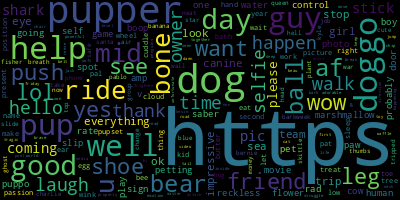

# Analysis Of The WeRateDogs Twitter Archive

Dogs are beloved pets. People all over the world love reading ratings of their pets. That is why an analysis of the [WeRateDogs Twitter Archive](https://twitter.com/dog_rates) would be a good exercise in analysing the different kinds of dogs in the world. These twitter page rates dogs and provides humorous comments about each dog. 

I hope you do enjoy this analysis.

## Data Gathering

Three datasets were used for data gathering although they were concerning tweets from the WeRateDogs twitter page. The first was put on the twitter_archive dataframe. This dataframe contains information on dog ratings and their stages. The second, image_predictions dataframe contains information on the breeds of the species that was put on the post that each tweet ID refers to. The third, counts_tweet is a dataframe that contains information on the retweet and favorites count for each post with a tweet ID. 

## Data Quality Assessment and Data Cleaning 

Visual and programmatic methods were used to assess the data. Some data quality issues found was that some of the information needed were embedded in html tags and had to be extracted, some columns had retweet data and so were not needs. In the image_predictions dataframe one data quality issue was that the algorithm used to predict the dog names. 

The data quality issues were not much. Some variables were spread across multiple columns and has to be harmonized for tidiness like the dog names in twitter_archive dataframe. Also, the counts_tweet dataframe is just a reflection of the information in the twitter_archive dataframe so for harmony I will have to merge these two. 

Data cleaning was carried out on the quality and tidiness issues discovered and then all the dataframes were merged to produce one single dataframe. This master dataframe was then saved as `twitter_archive_master.csv`. 

## Analyzing and Visualizing the Data

The data was analyzed based on these three questions:

1. What words did the tweet author use most frequently? It was found that the words "dog" and dog_stages like "doggo" were among the most frequently used words. Also, links on posts were very high on posts. Here is the word cloud from the text of the posts:

2. What apps does the tweet author use most frequently? It was found that the twitter app on iPhone was used all the time by the tweet author. 

3. What rating is most often given to dogs and what dog breeds are associated with those ratings? The most frequent rating is 12/10. Golden retrievers and labrador retrievers are more often associated with that rating. 

4. What 5 dog breed posts are most often retweeted? The highest was found to be labrador retrievers. The next were eskimo dogs and chihuahua. Reading the notebook to find out the others. 

5. What 5 dog breeds are most often liked or favorited? The highest was labrador retrievers. Eskimo dogs and chihuahua also fall into the list. 

## Conclusion

On a personal note, I would say that people like labrador retrieves a lot. I don't have dogs as pets, but I guess that when I have the inclination to buy one, I would take a look at a labrador retriever. 

I found an adorable picture of a labrador retriever below. 

 